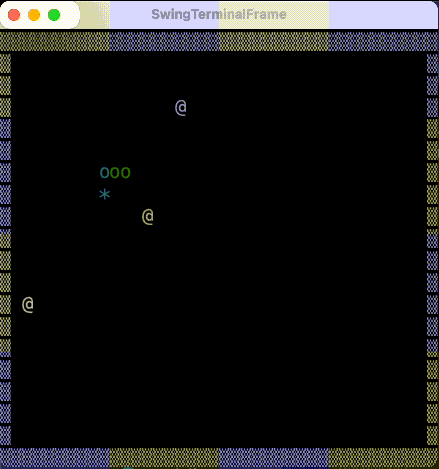
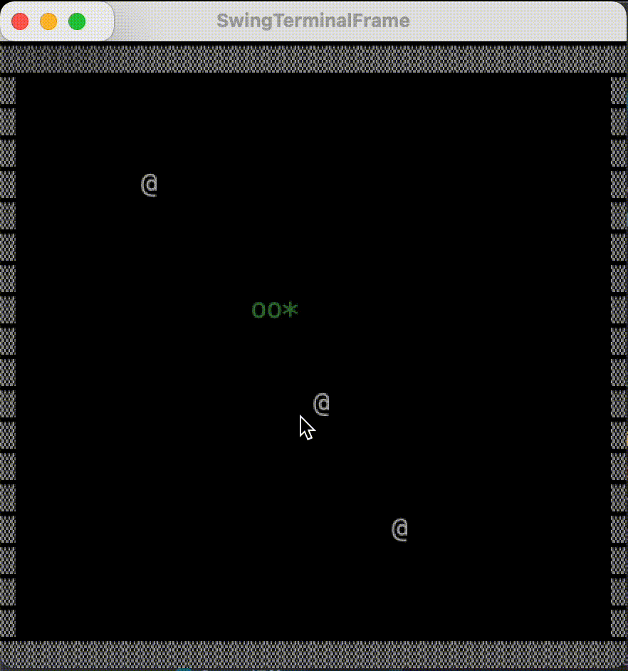

# LDTS - G0203 - Snake

Our game consists in a Snake based game.

In it, the user will be able to grow its own snake by eating randomized apples that generate themselves all over the board.
To increase difficulty, different speeds are available.

This project was developed by Afonso Pinto (up202008014@up.pt) and Raquel Carneiro (up202005330@up.pt) for LDTS 2021/2022.

## Gameplay DEMO

## Details of our game
### Main Menu
+ To play press 1
+ To check out the Instructions press 2
+ To change the Settings press 3
+ To exit the game press 0

### Instructions
To play you need to use the 4 arrows on your keyboard. In case you're in the middle of a game and you wanna pause it, then you need to press ESC.

### Settings
In your settings, you can customize the speed of your snake. You have 5 speeds available to experiment.

### Pause Menu

### Game Over Menu

###Planned Features
#### Snake
+ Follows the same direction when no key is pressed, that means that it can crawl by itself;
+ Grows in size by eating apples;
+ Dies if it touches a wall or if it touches itself.

## Code Smells and Possible Refactorings
We tried to refactor our code in a way that it could be more simple for others to understand it, without having to spending hours trying to understand the code.
To follow that idea, we avoided using comments in our code.

### Large Classes
Both Board and Menu should be simplified in a way that they could both be more readable and less exhausting to understand.

### Message Chains
In the method gameOver from Game, there are some exhausting chains, that made it more difficult to test the code.

### Feature Envy
The class Board treats a lot of content related to others than of itself. Some of those methods are about apples and walls, it would be more simple if they could handle their business, such as creating, for themselves.

## Self-evaluation
+ Afonso Pinto:
+ Raquel Carneiro:

